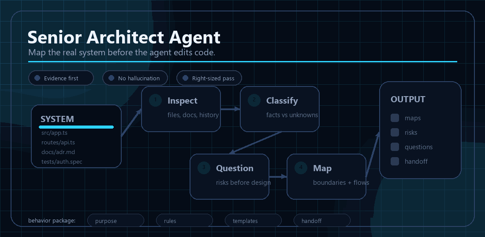
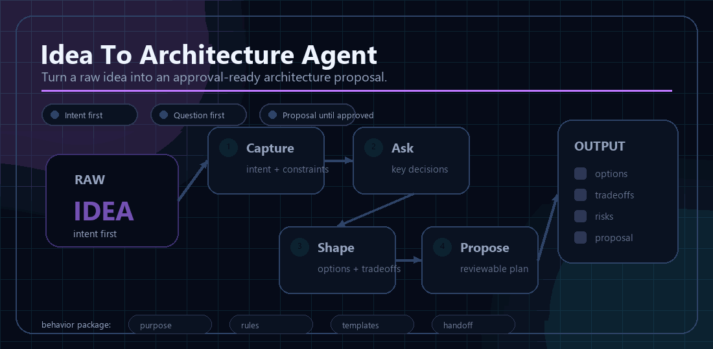
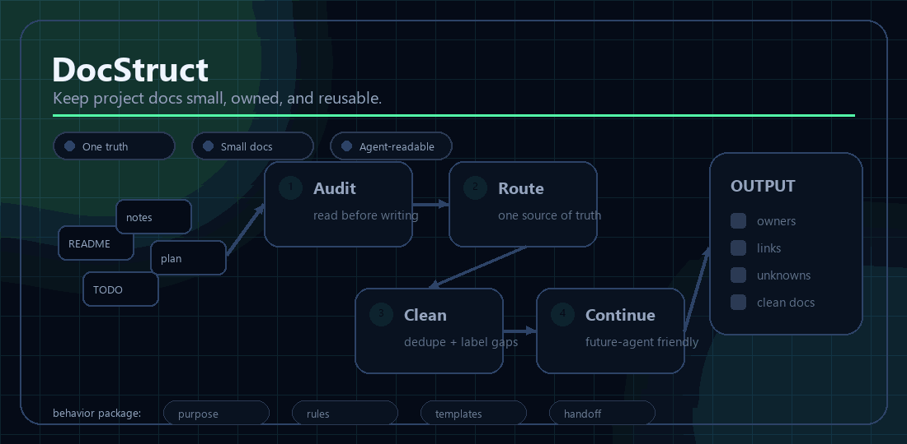

<div align="center">
  

  <h1>Aetox Skills</h1>

  <p>
    <strong>Practical AI agent skills for software builders.</strong>
  </p>

  <p>
    Reusable behavior packages that help AI agents inspect before acting,
    document what matters, preserve intent, mark uncertainty, and leave useful
    handoff context for the next human or agent.
  </p>

  <p>
    <a href="https://github.com/aetox-skills/aetox-skills"></a>
    <a href="https://github.com/aetox-skills/aetox-skills/blob/main/LICENSE"></a>
    
  </p>
</div>

---

## Skills That Make Agents Slower In The Right Places

Most AI coding workflows optimize for speed. Aetox Skills focuses on the
moments where going slower prevents expensive mistakes: understanding an
existing system, turning a raw idea into a reviewable architecture, and keeping
project documentation clean enough for repeated agent work.

These are not random prompt snippets. Each skill is a portable agent behavior
package with a clear purpose, operating rules, templates, examples, and
installation notes for modern AI agent environments.

## Featured Skills

| Skill | Use it when | What it produces |
| --- | --- | --- |
| [Senior Architect Agent](https://github.com/aetox-skills/senior-architect-agent) | An agent needs to map an existing codebase, review architecture boundaries, or prepare safe handoff notes. | Architecture maps, Mermaid diagrams, risks, open questions, and future-agent context. |
| [Idea To Architecture Agent](https://github.com/aetox-skills/idea-to-architecture-agent) | You have a raw product idea, feature request, or business goal with no implementation yet. | A question-first architecture proposal with assumptions, options, workflows, risks, and approval points. |
| [DocStruct](https://github.com/aetox-skills/docstruct) | Project documentation is duplicated, unclear, oversized, or hard for agents to continue from. | Source-of-truth documentation structure, ownership rules, compact docs, and cleanup guidance. |
| [Aetox Skills Catalog](https://github.com/aetox-skills/aetox-skills) | You want the central index, routing guidance, and release direction for the skill family. | Skill selection guidance and links to the current Aetox skill repositories. |

## See The Skills In Motion

### Senior Architect Agent



Map the real system before the agent edits code.

### Idea To Architecture Agent



Turn a raw idea into a reviewable architecture proposal.

### DocStruct



Keep project documentation small, owned, and reusable.

## Choose The Right Skill

```text
Existing codebase or system evidence?
  -> senior-architect-agent

Only a raw idea, product concept, or business goal?
  -> idea-to-architecture-agent

Documentation structure, duplication, ownership, or token cost?
  -> docstruct

Not sure?
  -> start with the Aetox Skills catalog
```

## Install

Install each skill from its own repository:

```text
aetox-skills/senior-architect-agent
aetox-skills/idea-to-architecture-agent
aetox-skills/docstruct
```

Each repository includes `SKILL.md`, `INSTALL.md`, adapter notes, examples, and
platform-specific guidance where useful.

## Principles

- Inspect before acting.
- Preserve user intent.
- Prefer clear boundaries over clever abstractions.
- Update existing documentation before creating more.
- Mark assumptions, inferences, unknowns, risks, and decisions explicitly.
- Treat Markdown and Mermaid as durable sources of truth.
- Make outputs useful for both humans and future AI agents.

## Built By

Aetox Skills is developed by Mike at Aetox, an independent AI systems lab in
Thailand.

- Website: [aetox.vercel.app/th](https://aetox.vercel.app/th)
- Email: [aetoxcompany@gmail.com](mailto:aetoxcompany@gmail.com)
